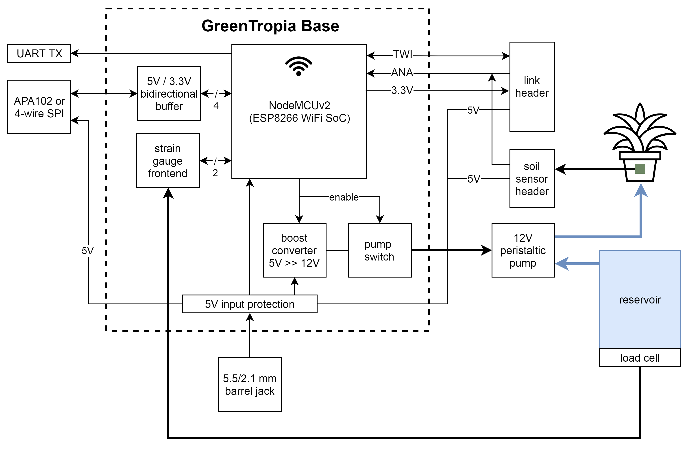
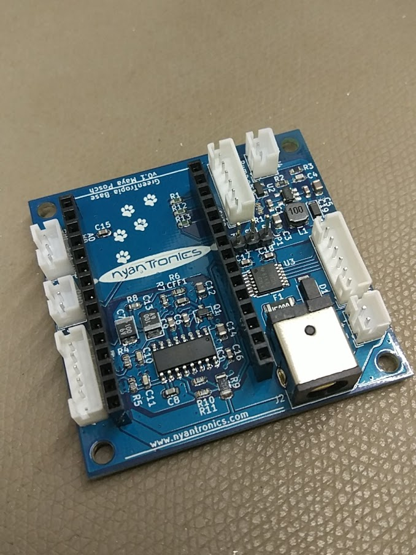

# Greentropia Base Board #

The [Greentropia](http://www.nyantronics.com/greentropia.php "Greentropia") (formerly IoP) Base board is a fairly simple PCB aimed at monitoring and watering single plants or similar configurations. Its block diagram looks as follows:

This is the final board (without NodeMCU board installed):

This repository contains the full KiCad project for the board. More information about the Greentropia project can be found at [Nyantronics](http://wwww.nyantronics.com/ "Nyantronics.com").